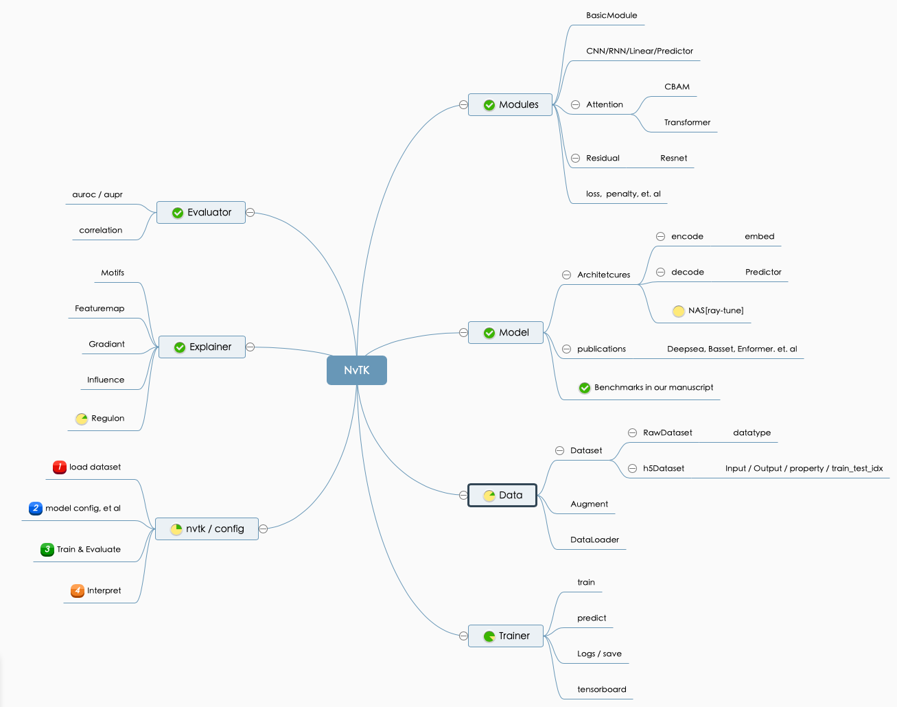

# NvTK 

Source code used for ```Systematic evaluation of deep learning for single-cell genomics data using NvTK```.

<div align=left></img></div>
NvTK (NvwaToolKit), is a systemmatic and easy-using deep learning software in genomics. NvTK support modern deep learning achitectures in genomics, such as Residual Module, ResNet, Attention Module, CBAM, Transformer and so on. 

<div align=center></img></div>

It's quite easy to train a deep learning model using a pre-defined model architecture in NvTK. I've re-implemented several published models in NvTK. At the same time, NvTK also support to automatically (or manually) search the best hyper-parameters of model architecture. Moreover, custumed and complicated model could be build with low-level modules in NvTK (NvTK.Trainer and Explainer always help me a lot). Importantly, NvTK is also easy to be extended with advanced deep learning modules based on pytorch. 

ps. Nvwa, the name of a mother god in ancient Chinese legend, is a deep learning–based strategy to predict expression landscapes and decipher regulatory elements (Filters) at the single-cell level. See our previous work in https://github.com/JiaqiLiZju/Nvwa.

## Requirements
- Python packages
```
python>=3.7
numpy
pandas>=0.21
matplotlib==3.0.*
# h5py > 2.10 may returns b'strings' reading h5file
h5py=2.10.0
tqdm
scikit-learn>=0.21.2
# torch >=1.10.1 support tensorboard, and ModifyOutputHook
torch>=1.10.1
tensorboard=2.7.0
captum=0.5.0
networkx
# higher version of scipy do not support resize
pillows
```

- external softwares (optional)
```
# meme could align the deep learning motif with known TFBS database
meme-5.4.1
# homer2 could search the motif in activated seqlets
homer2
```
<!-- biopython-1.79 -->

## News
- 2022.03.01: NvTK is quite unstable under activate development.
- 2022.03.23: updating BenchmarksInManuscript
- 2022.04.19: updating Documents, Tutorials
